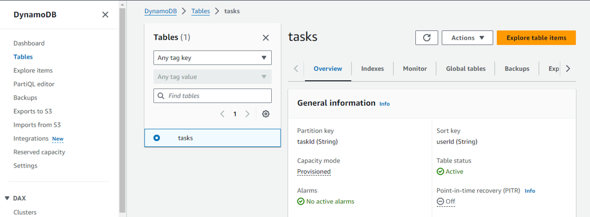
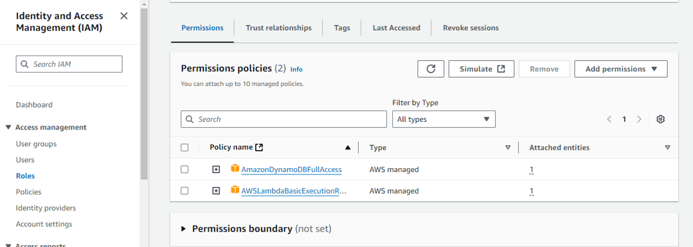
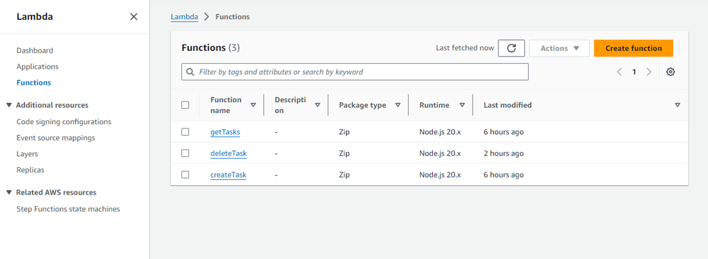

# Module 3: Serverless Service Backend

In this module you'll use [AWS Lambda][lambda] and [Amazon DynamoDB][dynamodb] to build a backend process for handling requests from your web application. The browser application that you deployed in the first module allows users to request that a unicorn be sent to a location of their choice. In order to fulfill those requests, the JavaScript running in the browser will need to invoke a service running in the cloud.

You'll implement a Lambda function that will be invoked each time a user requests a unicorn. The function will select a unicorn from the fleet, record the request in a DynamoDB table and then respond to the front-end application with details about the unicorn being dispatched.


The function is invoked from the browser using [Amazon API Gateway][api-gw]. You'll implement that connection in the next module. For this module you'll just test your function in isolation.
### Create an Amazon DynamoDB Table
Where to Perform: AWS Management Console

Navigate to [Amazon DynamoDB][dynamodb]
In the AWS Management Console, search for DynamoDB and select it.
Create a New Table:


+ Click "Create table".
+ Table Name: Tasks
+ Primary Key:
+ Partition Key: taskId (String)
+ Sort Key: userId (String)
+ Provisioned Capacity: Adjust as needed or use On-demand.
+ Auto Scaling: Configure if using provisioned capacity.
+ Encryption: Enable encryption at rest.
+ Click "Create".
Secondary Indexes (Optional):

If you need additional query capabilities, consider adding Global Secondary Indexes (GSIs).
Summary:

Action: Create a DynamoDB table named Tasks with taskId and userId as keys.
Location: AWS Management Console.
Outcome: Provides a storage solution for user tasks.

 ### 2.Develop AWS Lambda Functions
Where to Perform: AWS Management Console & Local Development Environment

Navigate to AWS Lambda:

In the AWS Management Console, search for Lambda and select it.
Create Lambda Functions:

i. Create Task Function (createTask)
Click on "Create function".

Function Name: createTask

Runtime: Node.js 14.x (or latest supported version)

Permissions:
[User Management][user-management] 

* Create a new role with basic Lambda permissions.
* After creation, attach additional permissions for DynamoDB access.
* Attach Policy: Use an existing policy like AmazonDynamoDBFullAccess 



Use the inline code editor or upload a ZIP file containing your code.

Sample Code (createTask.js):

```javascript
Copy code
// backend/createTask/createTask.js
const AWS = require('aws-sdk');
const dynamoDb = new AWS.DynamoDB.DocumentClient();
const { v4: uuidv4 } = require('uuid');

exports.handler = async (event) => {
  const { title, description, dueDate, priority } = JSON.parse(event.body);
  const userId = event.requestContext.authorizer.claims.sub;
  const taskId = uuidv4();

  const params = {
    TableName: 'Tasks',
    Item: {
      taskId,
      userId,
      title,
      description,
      dueDate,
      priority,
      createdAt: new Date().toISOString(),
      completed: false,
    },
  };

  try {
    await dynamoDb.put(params).promise();
    return {
      statusCode: 201,
      body: JSON.stringify({ taskId }),
    };
  } catch (error) {
    console.error('Error creating task:', error);
    return {
      statusCode: 500,
      body: JSON.stringify({ error: 'Could not create task' }),
    };
  }
};
````
ii. Get Tasks Function (getTasks)
Repeat the steps to create another Lambda function named getTasks.
Function Code:
Sample Code (getTasks.js):
```javascript
Copy code
// backend/getTasks/getTasks.js
const AWS = require('aws-sdk');
const dynamoDb = new AWS.DynamoDB.DocumentClient();

exports.handler = async (event) => {
  const userId = event.requestContext.authorizer.claims.sub;

  const params = {
    TableName: 'Tasks',
    KeyConditionExpression: 'userId = :uid',
    ExpressionAttributeValues: {
      ':uid': userId,
    },
  };

  try {
    const data = await dynamoDb.query(params).promise();
    return {
      statusCode: 200,
      body: JSON.stringify(data.Items),
    };
  } catch (error) {
    console.error('Error fetching tasks:', error);
    return {
      statusCode: 500,
      body: JSON.stringify({ error: 'Could not fetch tasks' }),
    };
  }
}; 
```
iii. Delete Task Function (deleteTask)
Repeat the steps to create another Lambda function named deleteTask.
Function Code:
Sample Code (deleteTask.js):
```javascript
Copy code
// backend/deleteTask/deleteTask.js
const AWS = require('aws-sdk');
const dynamoDb = new AWS.DynamoDB.DocumentClient();

exports.handler = async (event) => {
  const { taskId } = event.pathParameters;
  const userId = event.requestContext.authorizer.claims.sub;

  const params = {
    TableName: 'Tasks',
    Key: {
      taskId,
      userId,
    },
  };

  try {
    await dynamoDb.delete(params).promise();
    return {
      statusCode: 200,
      body: JSON.stringify({ message: 'Task deleted successfully' }),
    };
  } catch (error) {
    console.error('Error deleting task:', error);
    return {
      statusCode: 500,
      body: JSON.stringify({ error: 'Could not delete task' }),
    };
  }
};
```

Install Dependencies (If Necessary):

For UUID generation, you need the uuid package.
Option 1: Use Layers
Create a Lambda Layer with the uuid package and attach it to your Lambda functions.
Option 2: Package Dependencies Locally
```Create a ZIP Package:
bash
Copy code
mkdir createTask
cd createTask
npm init -y
npm install uuid
```
Add createTask.js to the directory.

Note: Using Lambda Layers is recommended for managing dependencies across multiple functions.

Configure Environment Variables:

In each Lambda function's Configuration tab, add environment variables if needed (e.g., table names).


## Summary:

* Action: Create and configure three Lambda functions (createTask, getTasks, deleteTask).
* Location: AWS Management Console and your local development environment.
* Outcome: Provides backend logic for managing tasks.


[amplify-console]: https://aws.amazon.com/amplify/console/
[cognito]: https://aws.amazon.com/cognito/
[lambda]: https://aws.amazon.com/lambda/
[api-gw]: https://aws.amazon.com/api-gateway/
[dynamodb]: https://aws.amazon.com/dynamodb/
[static-web-hosting]: ../1_StaticWebHosting/
[user-management]: ../2_UserManagement/
[restful-apis]: ../4_RESTfulAPIs/
[dynamodb-console]: https://console.aws.amazon.com/dynamodb/home
[iam-console]: https://console.aws.amazon.com/iam/home
[lambda-console]: https://console.aws.amazon.com/lambda/home
