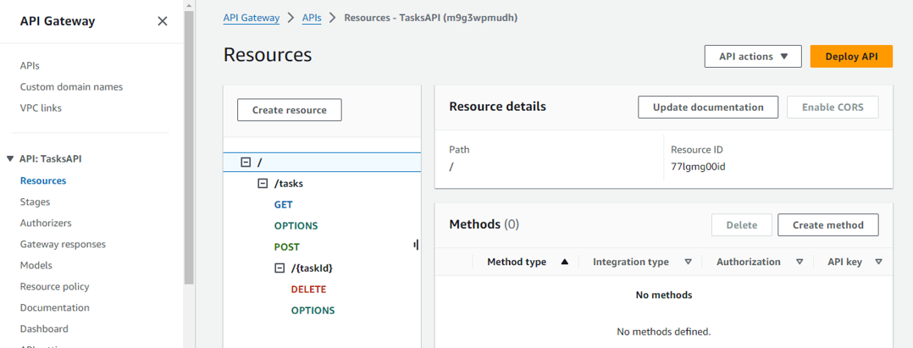
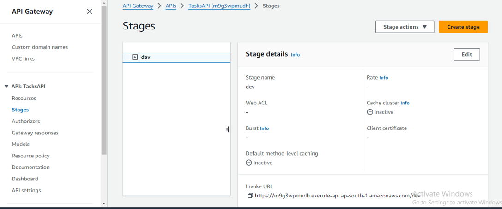
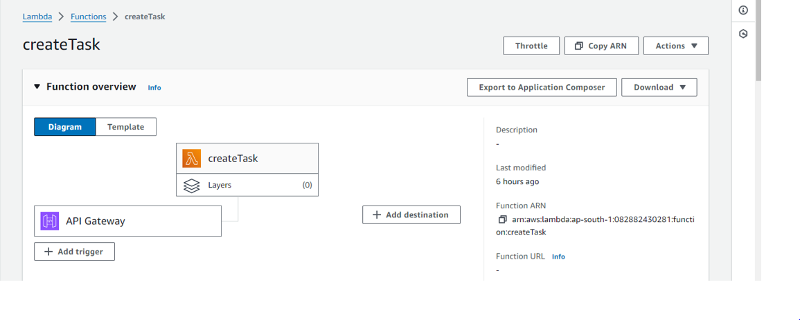

# Module 4: RESTful APIs with AWS Lambda and Amazon API Gateway

In this module you'll use API Gateway to expose the Lambda function you built in the [previous module][serverless-backend] as a RESTful API. This API will be accessible on the public Internet. It will be secured using the Amazon Cognito user pool you created in the [User Management][user-management] module. Using this configuration you will then turn your statically hosted website into a dynamic web application by adding client-side JavaScript that makes AJAX calls to the exposed APIs.


The diagram above shows how the API Gateway component you will build in this module integrates with the existing components you built previously. The grayed out items are pieces you have already implemented in previous steps.

The static website you deployed in the first module already has a page configured to interact with the API you'll build in this module. The page at /ride.html has a simple map-based interface for requesting a unicorn ride. After authenticating using the /signin.html page, your users will be able to select their pickup location by clicking a point on the map and then requesting a ride by choosing the "Request Unicorn" button in the upper right corner.

This module will focus on the steps required to build the cloud components of the API, but if you're interested in how the browser code works that calls this API, you can inspect the [ride.js](../1_StaticWebHosting/website/js/ride.js) file of the website. In this case the application uses jQuery's [ajax()](https://api.jquery.com/jQuery.ajax/) method to make the remote request.

## Implementation Instructions

:heavy_exclamation_mark: Ensure you've completed the [Serverless Backend][serverless-backend] step before beginning
the workshop.

Each of the following sections provides an implementation overview and detailed, step-by-step instructions. The overview should provide enough context for you to complete the implementation if you're already familiar with the AWS Management Console or you want to explore the services yourself without following a walkthrough.

### 1. Create a New REST API
Use the Amazon API Gateway console to create a new API name 

**:white_check_mark: Step-by-step directions**
1. Go to the [Amazon API Gateway Console][api-gw-console]
1. Choose **Create API**.
1. Select **REST**, **New API**  for the **API Name**.
1. Select `Edge optimized` from the **Endpoint Type** dropdown.
    ***Note***: Edge optimized are best for public services being accessed from the Internet. Regional endpoints are typically used for APIs that are accessed primarily from within the same AWS Region. Private APIs are for internal services inside of an Amazon VPC.
1. Choose **Create API**

    

### 2. Create Resources and Methods:

#### i. Create /tasks Resource:
+ In the Resources pane, click "Actions" > "Create Resource".
+ Resource Name: tasks
+ Resource Path: **/tasks**
+ Click "Create Resource".

#### ii. Create POST Method for /tasks:
+ Select the /tasks resource.
+ Click "Actions" > "Create Method" > Select POST > Checkmark.
+ Integration Type: Lambda Function
+ Use Lambda Proxy Integration: Yes
+ Lambda Region: Select your region.
+ Lambda Function: createTask
#### Click "Save" and "OK" to grant API Gateway permission to invoke your Lambda function.
#### iii. Create GET Method for /tasks:
+ Repeat the above steps to create a GET method for the /tasks resource.
+ Lambda Function: getTasks
#### iv. Create /tasks/{taskId} Resource:
+ In the Resources pane, click "Actions" > "Create Resource".
+ Resource Name: taskId
+ Resource Path: **/tasks/{taskId}**
+ Check "Configure as proxy resource" if desired.
+ Click "Create Resource".
#### v. Create DELETE Method for /tasks/{taskId}:
+ Select the /tasks/{taskId} resource.
+ Click "Actions" > "Create Method" > Select DELETE > Checkmark.
+ Integration Type: Lambda Function
+ Use Lambda Proxy Integration: Yes
+ Lambda Function: deleteTask
+ Click "Save" and "OK".


### 3. Enable CORS (Cross-Origin Resource Sharing):

+ For each method (POST, GET, DELETE), enable CORS to allow your frontend to communicate with the API.
#### Steps:
+ Select the method.
+ Click "Actions" > **Enable CORS**.
+ Review the settings and click "Enable CORS and replace existing CORS headers".
+ Confirm by clicking "Yes, replace existing values".


### 4. Deploy Your API
From the Amazon API Gateway console, choose Actions, Deploy API. You'll be prompted to create a new stage. You can use dev for the stage name.

**:white_check_mark: Step-by-step directions**
1. In the **Actions** drop-down list select **Deploy API**.
1. Select **[New Stage]** in the **Deployment stage** drop-down list.
1. Enter `dev` for the **Stage Name**.
1. Choose **Deploy**.
1. Note the **Invoke URL**. You will use it in the next section.




### 5. Update the Website Config
Update the /js/config.js file in your website deployment to include the invoke URL of the stage you just created. You should copy the invoke URL directly from the top of the stage editor page on the Amazon API Gateway console and paste it into the \_config.api.invokeUrl key of your sites /js/config.js file. Make sure when you update the config file it still contains the updates you made in the previous module for your Cognito user pool.

**:white_check_mark: Step-by-step directions**
1. On your Cloud9 development environment open `js/config.js`
1. Update the **invokeUrl** setting under the **api** key in the config.js file. Set the value to the **Invoke URL** for the deployment stage your created in the previous section.
    An example of a complete `config.js` file is included below. Note, the actual values in your file will be different.
    ```JavaScript
    window._config = {
        cognito: {
            userPoolId: 'us-west-2_uXboG5pAb', // e.g. us-east-2_uXboG5pAb
            userPoolClientId: '25ddkmj4v6hfsfvruhpfi7n4hv', // e.g. 25ddkmj4v6hfsfvruhpfi7n4hv
            region: 'us-west-2' // e.g. us-east-2
        },
        api: {
            invokeUrl: 'https://rc7nyt4tql.execute-api.us-west-2.amazonaws.com/prod' // e.g. https://rc7nyt4tql.execute-api.us-west-2.amazonaws.com/prod,
        }
    };
    ```

1. Save the modified file making sure the filename is still `config.js`.
1. Commit the changes to your git repository:
    ```
    $ git add js/config.js 
    $ git commit -m "configure api invokeURL"
    $ git push
    ...
    Counting objects: 4, done.
    Compressing objects: 100% (4/4), done.
    Writing objects: 100% (4/4), 422 bytes | 422.00 KiB/s, done.
    Total 4 (delta 3), reused 0 (delta 0)
    To https://git-codecommit.us-east-1.amazonaws.com/v1/repos/
       c15d5d5..09f1c9a  master -> master
    ```

    [Amplify Console][amplify-console-console] should pick up the changes and begin building and deploying your web application. Watch it to verify the completion of the deployment.


### :star: Recap

:key: [Amazon API Gateway][api-gw] is a fully managed service that makes it easy for developers to create, publish, maintain, monitor, and secure APIs at any scale. You can easily plug in Authorization via [Amazon Cognito][cognito] and backends such as [AWS Lambda][lambda] to create completely serverless APIs.

:wrench: In this module you've used API Gateway to provide a REST API to the Lambda function created in the previous module. From there you've updated the website to use the API endpoint so that you can request rides and the information about the ride is saved in the DynamoDB table created earlier.

 ### Next

:white_check_mark: delete the resources you've created.

[amplify-console]: https://aws.amazon.com/amplify/console/
[amplify-console-console]: https://console.aws.amazon.com/amplify/home
[api-gw]: https://aws.amazon.com/api-gateway/
[api-gw-console]: https://console.aws.amazon.com/apigateway/home

[cognito-console]: https://console.aws.amazon.com/cognito/home
[cognito]: https://aws.amazon.com/cognito/
[configjs]: ../1_StaticWebHosting/website/js/config.js
[dynamodb-console]: https://console.aws.amazon.com/dynamodb/home
[dynamodb]: https://aws.amazon.com/dynamodb/
[iam-console]: https://console.aws.amazon.com/iam/home
[jwt-decoder]: https://jwt.io/
[lambda-console]: https://console.aws.amazon.com/lambda/home
[lambda]: https://aws.amazon.com/lambda/
[restful-apis]: ../4_RESTfulAPIs/
[serverless-backend]: ../3_ServerlessBackend/

[static-web-hosting]: ../1_StaticWebHosting/
[user-management]: ../2_UserManagement/